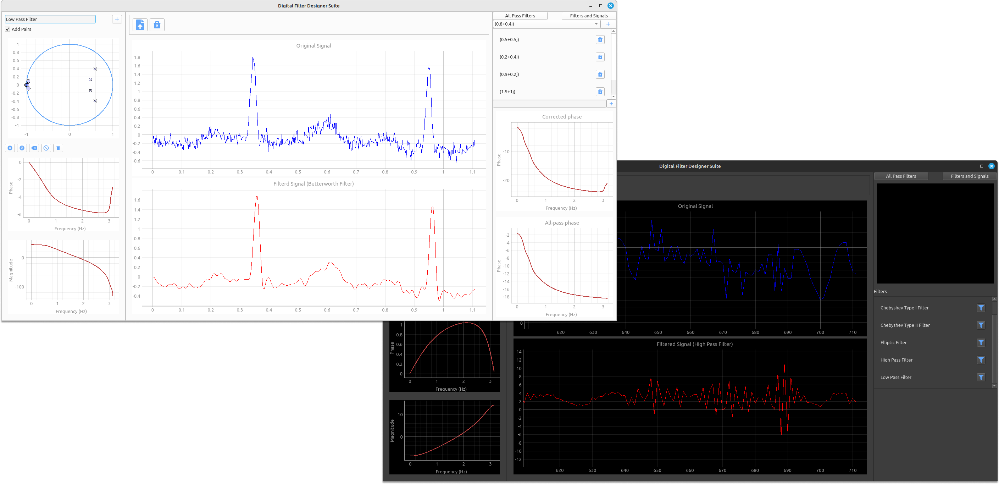

# Digital Filter Designer Suite

Digital Filter Designer Suite is a powerful desktop application developed using PyQt that empowers users to design digital filters with precision. This suite provides an interactive environment for designing filters on the unit circle, offering visualizations of phase and magnitude responses. Users can manipulate filters by adding poles and zeros, either as single entities or in conjugate pairs, and can dynamically adjust their positions.



## Table of Contents

- [Features](#features)
- [Getting Started](#getting-started)
- [Usage](#usage)
- [Contributors](#contributors)

## Features

- **Interactive Unit Circle Design:** Design filters directly on the unit circle, visualizing both phase and magnitude responses.

- **Pole and Zero Manipulation:**

  - Add poles and zeros individually or as conjugate pairs.
  - Ctrl+click on the unit circle to add poles and zeros.
  - Drag and drop poles and zeros to reposition them.
  - Double-click on a pole or zero to delete it.

- **All Pass Filters:** Incorporate different all-pass filters to correct phase-related characteristics.

- **Signal Visualization:**
  - Upload signals to visualize the filter design.
  - Create custom signals using the touchpad for more personalized testing.

## Getting Started

### Prerequisites

- Python 3.6 or higher
- PyQt6

### Installation

1. Clone this repository to your local machine.

```bash
git clone https://github.com/bodykudo/digital-filter-designer-suite.git
```

2. Install the required dependencies.

```bash
pip install requirements.txt
```

3. Run the application.

```bash
python main.py
```

## Usage

1. **Filter Design:**

- Design filters by adding poles and zeros on the unit circle.
- Use Ctrl+click to add poles/zeros and drag-drop to reposition them.
- Double-click on a pole/zero to delete it.

2. **All Pass Filters:**

   - Explore and apply different all-pass filters to correct phase responses.

3. **Signal Integration:**

- Upload signals to visualize the impact of the filter design.
- Create custom signals using the touchpad for precise testing.

## Contributors

<table>
  <tr>
    <td align="center">
    <a href="https://github.com/Bodykudo" target="_black">
    
    <br />
    <sub><b>Abdallah Magdy</b></sub></a>
    <td align="center">
    <a href="https://github.com/abduelrahmanemad" target="_black">
    
    <br />
    <sub><b>Abdelrahman Emad</b></sub></a>
    </td>
    </td>
    <td align="center">
    <a href="https://github.com/MohamedAlaaAli" target="_black">
    
    <br />
    <sub><b>Mohamed Alaa</b></sub></a>
    </td>
    <td align="center">
   <td align="">
    <a href="https://github.com/Medo072" target="_black">
    
    <br />
    <sub><b>Mohamed Ibrahim</b></sub></a>
    </td>
    </tr>
 </table>

---

Explore the world of digital filter design with precision using the Digital Filter Designer Suite!
